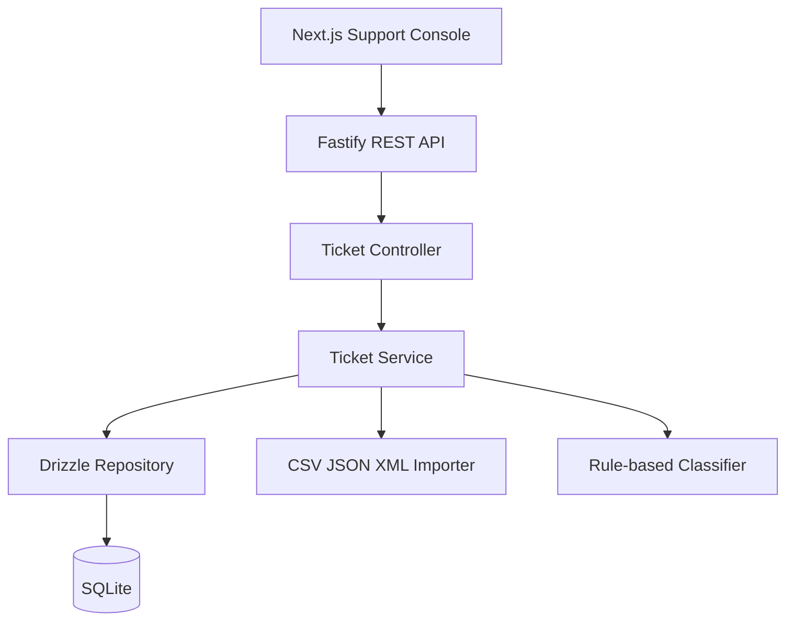

# Intelligent Customer Support System

> Student Name: ilia makarov  
> Date Submitted: 05.07.2026  
> AI Tools Used: Codex

## Project Overview

This repository is now organized as a full-stack customer support system:

- `backend/`: Fastify REST API with Drizzle ORM, SQLite, Jest tests, bulk import, and auto-classification.
- `frontend/`: Next.js + Tailwind support console for ticket operations, filtering, creation, import, and classification.

The frontend consumes the backend through `NEXT_PUBLIC_API_BASE_URL`, defaulting to `http://localhost:3001/api/v1`.

## Architecture



## Setup

```bash
npm install
npm run db:seed
npm run dev:backend
npm run dev:frontend
```

Default local URLs:

- Backend API: `http://localhost:3001/api/v1`
- Frontend: `http://localhost:3000`

The frontend includes `frontend/AGENTS.md` and `frontend/CLAUDE.md` for AI coding agents. They point agents to the version-matched Next.js docs bundled in `frontend/node_modules/next/dist/docs/`.

## Scripts

```bash
npm run dev:backend      # backend on port 3001
npm run dev:frontend     # Next.js frontend
npm run build            # backend + frontend production builds
npm test                 # backend Jest tests
npm run test:coverage    # backend coverage report
npm run db:generate      # generate Drizzle migrations
npm run db:seed          # reset and seed demo data
```

`npm run db:seed -- --append` adds missing demo records without clearing existing data.

## Project Structure

```text
backend/
  src/
  tests/
  drizzle/
  docs/API_REFERENCE.md
  package.json
frontend/
  AGENTS.md
  CLAUDE.md
  src/app/
  src/components/
  src/lib/
  src/types/
  package.json
wiki/
  raw/
  *.md
```

See [backend/docs/API_REFERENCE.md](./backend/docs/API_REFERENCE.md) for endpoint examples.
