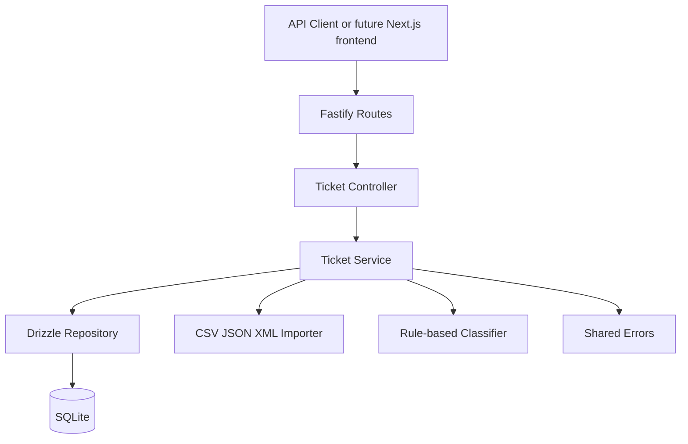

# Intelligent Customer Support API

> Student Name: ilia makarov  
> Date Submitted: 05.07.2026  
> AI Tools Used: Codex

## Project Overview

This project implements the backend REST API for Homework 2: an intelligent customer support system. It supports ticket CRUD, filtering, bulk import from CSV/JSON/XML, deterministic auto-classification, manual classification override protection, SQLite persistence via Drizzle ORM, and automated tests.

The frontend is intentionally not implemented here yet. The API is a standalone Fastify service with CORS enabled so a future Next.js app can consume it as a separate client.

## Features

- Create, list, filter, update, delete, and fetch support tickets.
- Bulk import tickets from CSV, JSON, or XML request content.
- Per-record import summaries with validation errors.
- Rule-based category and priority classification.
- Classification confidence, reasoning, matched keywords, and decision log.
- Manual category/priority overrides preserved unless `force=true` is used.
- SQLite storage through Drizzle ORM, defaulting to `./data/support.db`.
- Jest coverage threshold configured at >85%.

## Architecture



## Setup

```bash
npm install
npm run dev
```

The API runs on `http://localhost:3000` by default.

## Test Commands

```bash
npm run build
npm test
npm run test:coverage
npm run db:generate
npm run db:seed
```

`npm run db:seed` resets `./data/support.db` and creates 10 classified demo tickets. Use `npm run db:seed -- --append` to add only missing demo records without clearing existing data.

## Project Structure

```text
src/
  app.ts
  server.ts
  routes.ts
  shared/
  modules/
    tickets/
      ticket.controller.ts
      ticket.routes.ts
      ticket.schema.ts
      ticket.model.ts
      ticket.repository.ts
      ticket.service.ts
      ticket.importer.ts
      ticket.classifier.ts
  config/
    database.ts
tests/
  fixtures/
  test_*.test.ts
docs/
  API_REFERENCE.md
```

See [API_REFERENCE.md](./docs/API_REFERENCE.md) for endpoint examples.
