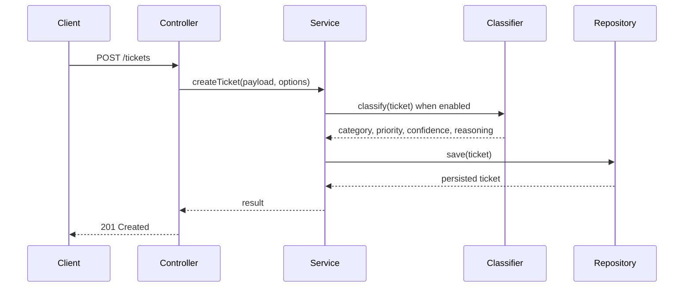
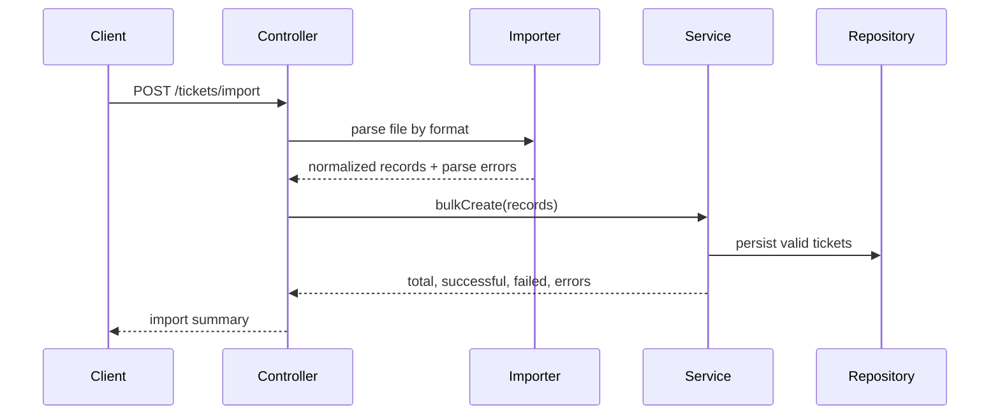

# Architecture Overview

This page defines the current architecture for `homework-2`. The project is organized as a full-stack repository with a backend REST API and a frontend built with Next.js.

## Core Stack

- **Backend runtime**: Node.js 18+
- **Backend framework**: REST API server, following the same module-oriented MVC structure used in `homework-1`
- **Frontend framework**: Next.js App Router with Tailwind CSS
- **Package layout**: npm workspaces with `backend/` and `frontend/`
- **Primary domain**: Customer support ticket management, import, validation, auto-classification, and test/documentation generation

## Backend Architecture

The backend keeps the `homework-1` structure and responsibilities, but replaces the banking transaction domain with customer support tickets.

```text
homework-2/
├── backend/
│   ├── src/
│   │   ├── app.ts
│   │   ├── server.ts
│   │   ├── routes.ts
│   │   ├── config/database.ts
│   │   ├── db/seed.ts
│   │   ├── modules/tickets/
│   │   └── shared/
│   ├── drizzle/
│   ├── tests/
│   └── docs/
└── frontend/
    ├── src/app/
    ├── src/components/
    ├── src/lib/
    └── src/types/
```

## Backend Module Responsibilities

- **Routes**: Bind endpoints under `/api/v1`, such as `POST /tickets`, `POST /tickets/import`, `GET /tickets`, `GET /tickets/:id`, `PUT /tickets/:id`, `DELETE /tickets/:id`, and `POST /tickets/:id/auto-classify`.
- **Controller**: Validate request shape, call services, and return HTTP responses with correct status codes.
- **Service**: Own ticket lifecycle rules, filtering behavior, manual overrides, import summaries, and classification orchestration.
- **Repository**: Encapsulate persistence and query operations.
- **Model**: Define stored ticket fields, classification metadata, timestamps, and import-related metadata.
- **Importer**: Parse CSV, JSON, and XML files, normalize records, collect per-record errors, and return bulk import summaries.
- **Classifier**: Apply deterministic category and priority rules, return confidence, reasoning, and matched keywords.
- **Shared error handler**: Convert validation, parsing, not-found, and domain errors into stable API error responses.

## Data Flow



## Import Flow



## Frontend Architecture

The frontend is implemented in `frontend/` and consumes the REST API through `NEXT_PUBLIC_API_BASE_URL`, defaulting to `http://localhost:3001/api/v1`.

- `src/app/`: App Router entry points and global CSS.
- `src/components/ticket-dashboard.tsx`: Main support console with list, filters, create form, import form, ticket detail, classification, status update, and delete actions.
- `src/lib/api.ts`: REST API client.
- `src/types/ticket.ts`: Frontend TypeScript contracts for ticket data.

See [Frontend Application](./frontend.md) for the current frontend details.

## Design Decisions

- Reuse the `homework-1` MVC/module pattern to keep backend boundaries clear.
- Keep import parsing separate from ticket lifecycle services so file-format concerns do not leak into core domain logic.
- Keep classification separate from controllers and repositories so the rules can later be replaced or expanded.
- Treat Next.js as a separate application layer that talks to the REST API rather than embedding backend business logic in the frontend.
- Keep backend and frontend as separate npm workspaces so each layer can evolve independently while sharing one repository.
