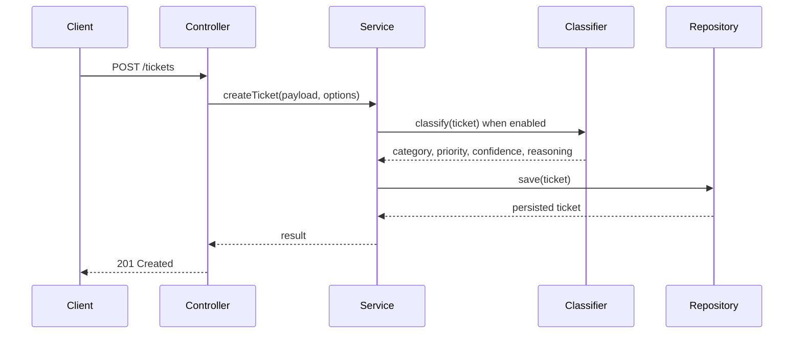
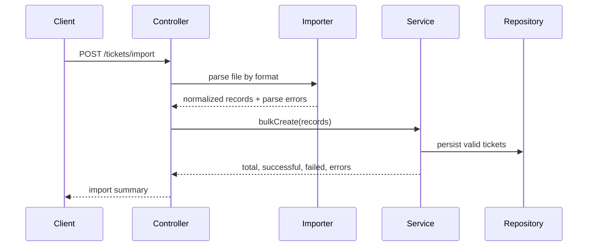

# Architecture Overview

This page defines the planned architecture for `homework-2`. The project will include a backend REST API and a frontend built with Next.js.

## Core Stack

- **Backend runtime**: Node.js 18+
- **Backend framework**: REST API server, following the same module-oriented MVC structure used in `homework-1`
- **Frontend framework**: Next.js
- **Primary domain**: Customer support ticket management, import, validation, auto-classification, and test/documentation generation

## Backend Architecture

The backend should keep the `homework-1` structure and responsibilities, but replace the banking transaction domain with customer support tickets.

```text
homework-2/
└── src/
    ├── app.ts                         # App factory and middleware registration
    ├── server.ts                      # Server entry point
    ├── routes.ts                      # Top-level route registration
    ├── config/
    │   └── database.ts                # Database connection and ORM setup
    ├── modules/
    │   └── tickets/
    │       ├── ticket.controller.ts   # HTTP request/response handling
    │       ├── ticket.routes.ts       # REST endpoint registration
    │       ├── ticket.schema.ts       # Request, response, import, and filter schemas
    │       ├── ticket.model.ts        # Persistent ticket model
    │       ├── ticket.repository.ts   # Data access layer
    │       ├── ticket.service.ts      # Ticket lifecycle business logic
    │       ├── ticket.importer.ts     # CSV, JSON, and XML import orchestration
    │       └── ticket.classifier.ts   # Category/priority classification rules
    └── shared/
        ├── constants.ts               # Enums, limits, default values
        ├── errors.ts                  # Custom error classes
        └── error-handler.ts           # Central error response mapping
```

## Backend Module Responsibilities

- **Routes**: Bind endpoints such as `POST /tickets`, `POST /tickets/import`, `GET /tickets`, `GET /tickets/:id`, `PUT /tickets/:id`, `DELETE /tickets/:id`, and `POST /tickets/:id/auto-classify`.
- **Controller**: Validate request shape, call services, and return HTTP responses with correct status codes.
- **Service**: Own ticket lifecycle rules, filtering behavior, manual overrides, import summaries, and classification orchestration.
- **Repository**: Encapsulate persistence and query operations.
- **Model**: Define stored ticket fields, classification metadata, timestamps, and import-related metadata.
- **Importer**: Parse CSV, JSON, and XML files, normalize records, collect per-record errors, and return bulk import summaries.
- **Classifier**: Apply deterministic category and priority rules, return confidence, reasoning, and matched keywords.
- **Shared error handler**: Convert validation, parsing, not-found, and domain errors into stable API error responses.

## Data Flow



## Import Flow



## Frontend Architecture Placeholder

The frontend will be a Next.js application that consumes the REST API. Details are intentionally deferred, but the wiki should already reserve space for:

- Ticket list, filtering, and detail views
- Create/edit ticket forms
- Bulk import workflow
- Auto-classification status and manual override controls
- API error presentation and loading states

See [Frontend Shell](./frontend.md) for the current placeholder.

## Design Decisions

- Reuse the `homework-1` MVC/module pattern to keep backend boundaries clear.
- Keep import parsing separate from ticket lifecycle services so file-format concerns do not leak into core domain logic.
- Keep classification separate from controllers and repositories so the rules can later be replaced or expanded.
- Treat Next.js as a separate application layer that talks to the REST API rather than embedding backend business logic in the frontend.
