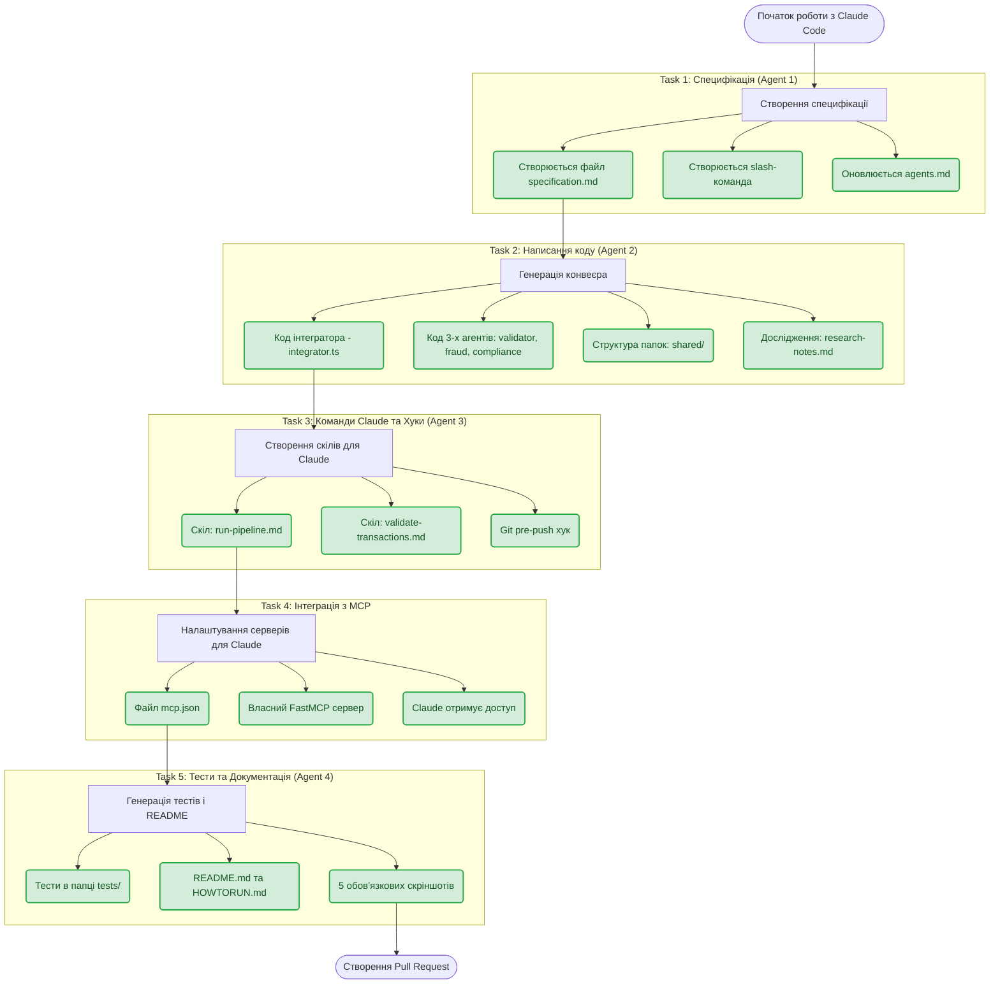
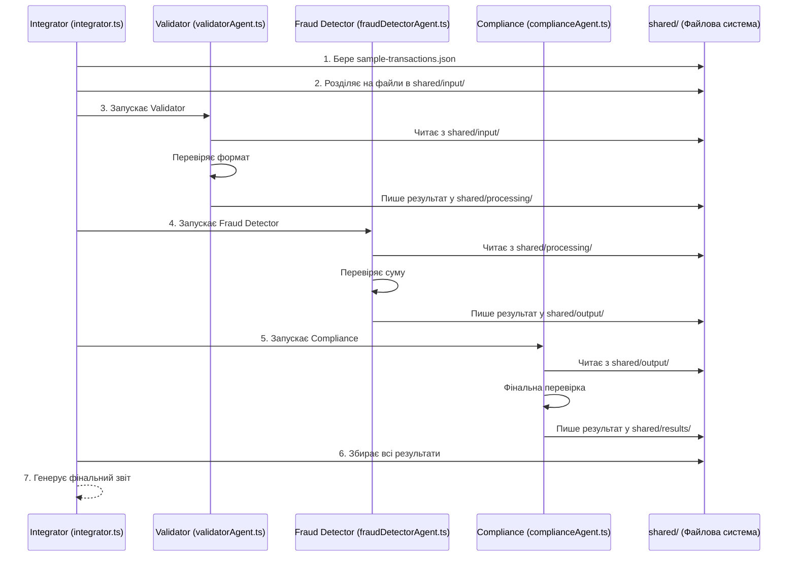
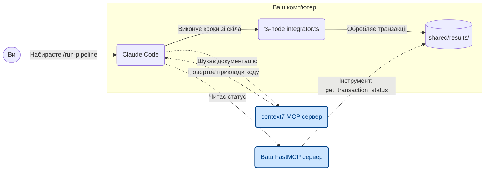

# Роз'яснення до завдання: ШІ-Агенти проти TypeScript-Скриптів

У цьому завданні слово «агент» використовується у двох абсолютно різних значеннях. Оскільки ми домовилися використовувати **TypeScript**, давайте розділимо все на два рівні, щоб уникнути плутанини:

## Рівень 1: «ШІ-Агенти» (AI Meta-Agents) — це ваші помічники (Claude Code)
Це **НЕ** TypeScript скрипти. Це ролі, які ви призначаєте штучному інтелекту (Claude Code), щоб він допоміг вам зробити домашнє завдання. Ви виступаєте в ролі менеджера, а Claude Code виконує роботу за чотирьох спеціалістів:

1. **AI Agent 1 (Бізнес-аналітик):** Ви просите Claude: *"Напиши специфікацію проєкту"*. Він генерує Markdown файл.
2. **AI Agent 2 (Програміст):** Ви просите Claude: *"Напиши TypeScript код для обробки транзакцій"*. Він генерує `.ts` файли.
3. **AI Agent 3 (QA Інженер / DevOps):** Ви просите Claude: *"Напиши юніт-тести на Jest і налаштуй Git Hooks"*.
4. **AI Agent 4 (Технічний письменник):** Ви просите Claude: *"Напиши README.md"*.

## Рівень 2: «TypeScript-Агенти» (Pipeline Agents) — це сам код
Це те, що згенерує **AI Agent 2**. У контексті банківської системи "агентами" називають прості TypeScript скрипти (або функції), які виконують конкретну бізнес-логіку. Штучного інтелекту в них **немає** — це просто жорстко прописаний код.

Ось як виглядатимуть ваші TypeScript скрипти (згенеровані Клодом):

1. **`integrator.ts` (Головний скрипт):** Читає початковий JSON, створює папки `shared/...`, і по черзі запускає інші TypeScript-скрипти.
2. **`validatorAgent.ts`:** Читає файл з папки `shared/input`. Перевіряє регулярками або звичайним кодом наявність полів (напр., amount, currency). Переміщує файл у папку `shared/processing` або записує помилку.
3. **`fraudDetectorAgent.ts`:** Читає файл з `shared/processing`. Робить просту математику (наприклад, сума > 10000 = ризик). Переміщує в `shared/output`.
4. **`complianceAgent.ts`:** Робить фінальну перевірку і кладе готовий результат у `shared/results`.

---

## Блок-схеми виконання завдань

Ось візуалізація процесу у вигляді блок-схем, адаптована під роботу з Claude Code.

### 1. Загальний процес виконання завдання (Claude Code Workflow)

Ця схема показує, в якому порядку потрібно виконувати завдання і які артефакти (результати) ви повинні отримати після кожного кроку.

### 2. Як працює сам Pipeline (Те, що згенерує Agent 2)

### 3. Схема роботи з Claude Code та MCP

