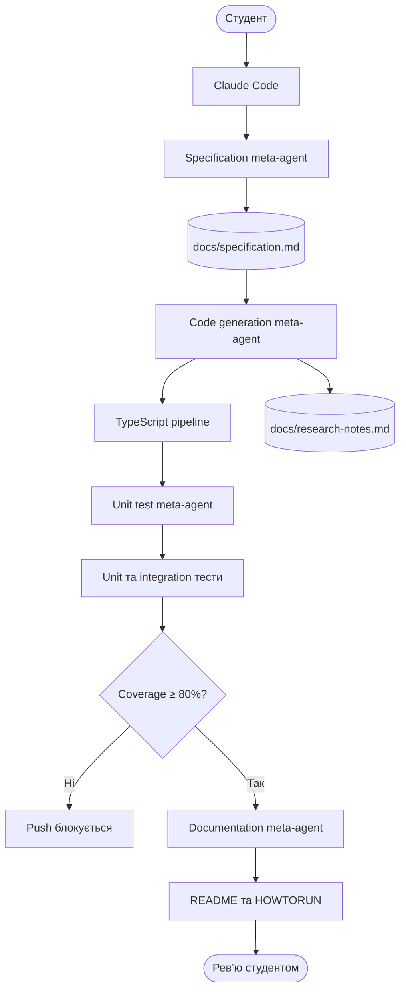
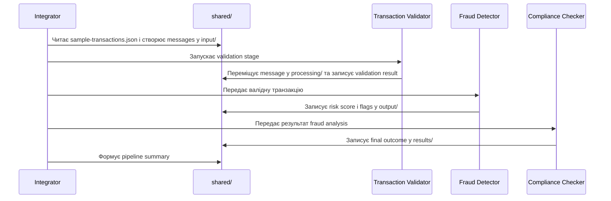
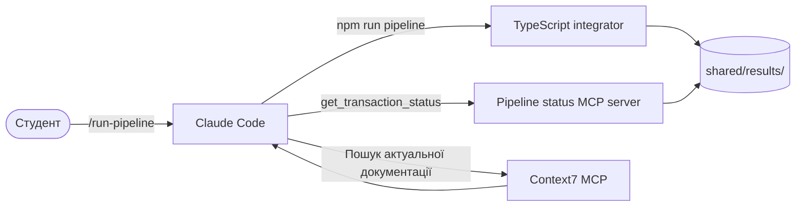

# Homework 6: AI-powered multi-agent banking pipeline

> **Студент:** ilia makarov  
> **Мова реалізації:** TypeScript  
> **Поточний стан:** проєктування документації та AI-інфраструктури

## Про що цей проєкт

Мета Homework 6 — за допомогою Claude Code створити робочий застосунок, який послідовно обробляє банківські транзакції з `sample-transactions.json`. Застосунок перевірятиме транзакції, визначатиме ризик шахрайства, виконуватиме compliance-перевірку та записуватиме результат кожної транзакції в `shared/results/`.

Deliverable складається з двох частин: AI-інфраструктури для розробки та самого TypeScript-застосунку. Це два різні рівні, хоча в умові обидва названі «агентами».

> Claude Code не обробляє транзакції замість застосунку. AI допомагає створити, перевірити, запустити й задокументувати систему, а банківську логіку виконує звичайний детермінований TypeScript-код.

## Два рівні агентів

### Рівень 1: AI meta-agents у Claude Code

Це спеціалізовані AI-workflows, які створюють артефакти проєкту:

| AI meta-agent | Відповідальність | Результат |
|---|---|---|
| Specification agent | Формує та перевіряє технічну специфікацію | `docs/specification.md` |
| Code generation agent | Реалізує TypeScript pipeline та використовує Context7 | TypeScript-код і `docs/research-notes.md` |
| Unit test agent | Створює unit/integration тести та контролює coverage | `tests/` і coverage gate |
| Documentation agent | Підтримує документацію проєкту | `README.md`, `HOWTORUN.md`, `docs/log.md` |

Ці агенти працюють під час розробки. Вони не є частиною банківського runtime.

### Рівень 2: TypeScript pipeline agents

Це звичайні TypeScript-модулі без LLM:

| Pipeline agent | Відповідальність |
|---|---|
| Transaction validator | Перевіряє обов’язкові поля, додатну точну суму та ISO 4217 currency code |
| Fraud detector | Обчислює risk score за великою сумою, незвичним часом і cross-border ознаками |
| Compliance checker | Приймає фінальне рішення та пояснює причину review/rejection |

`integrator.ts` послідовно викликатиме ці модулі. Для однієї транзакції вони не працюватимуть паралельно, тому що кожен наступний етап використовує результат попереднього.

## Загальний workflow Claude Code



## Як працюватиме TypeScript pipeline



Невалідна транзакція не зникає: для неї одразу створюється фінальний `rejected` result із причиною. Після запуску всі транзакції з input повинні бути представлені в `shared/results/`.

ASCII-схема того самого runtime flow, обов’язкова для документації завдання:

```text
sample-transactions.json
          |
          v
   +--------------+
   | integrator.ts|
   +--------------+
          |
          v
+-----------------------+     invalid     +------------------+
| transaction-validator | --------------> | shared/results/  |
+-----------------------+                 | status: rejected |
          | valid                         +------------------+
          v
+----------------+
| fraud-detector |
+----------------+
          |
          v
+--------------------+
| compliance-checker |
+--------------------+
          |
          v
 +----------------+
 | shared/results/|
 +----------------+
```

## Claude Code, pipeline та MCP



Custom MCP server не обробляє транзакції. Він лише читає готові результати та надає Claude Code tools `get_transaction_status`, `list_pipeline_results` і resource `pipeline://summary`.

## Файлова комунікація

Застосунок використовуватиме обов’язковий JSON-протокол:

```text
shared/
├── input/       # початкові messages
├── processing/  # message, який зараз обробляється
├── output/      # проміжний результат для наступного agent
└── results/     # фінальні outcomes і summary
```

Кожне повідомлення матиме UUID, ISO 8601 timestamp, source/target agent, message type і transaction data. Account numbers та інші PII не потраплятимуть у plaintext logs.

## Запланований технологічний стек

| Частина | Технологія | Навіщо |
|---|---|---|
| Runtime | Node.js LTS | Запуск TypeScript-застосунку |
| Мова | TypeScript strict mode | Типобезпечна бізнес-логіка |
| Framework | Fastify | Мережевий/API та інтеграційний шар, якщо він потрібен |
| Money | Decimal library | Точні грошові значення без JavaScript floating-point помилок |
| File protocol | JSON у `shared/` | Обов’язкова комунікація між pipeline agents |
| Database, якщо потрібна | SQLite | Локальне довготривале зберігання без окремого DB server |
| ORM, якщо потрібна | Drizzle ORM | Type-safe доступ до SQLite |
| MCP | TypeScript MCP server | Запити Claude Code до pipeline results |

SQLite та Drizzle не додаються без конкретної потреби й не замінюють файловий протокол із завдання.

## Канонічна документація

- [`TASKS.md`](./TASKS.md) — оригінальні вимоги домашнього завдання.
- [`AGENTS.md`](./AGENTS.md) — головні правила для Claude Code, Codex і Gemini.
- [`docs/specification.md`](./docs/specification.md) — технічна специфікація pipeline.
- [`docs/research-notes.md`](./docs/research-notes.md) — Context7 queries та застосовані висновки.
- [`docs/log.md`](./docs/log.md) — append-only хронологія змін.
- `HOWTORUN.md` — буде створено разом із runnable TypeScript pipeline.

## Поточний стан

Зараз створюється документаційний фундамент і Claude Code scaffold. TypeScript pipeline, тести, coverage gate та MCP server ще не реалізовані. README буде оновлюватися лише на основі фактично перевіреного стану репозиторію.
