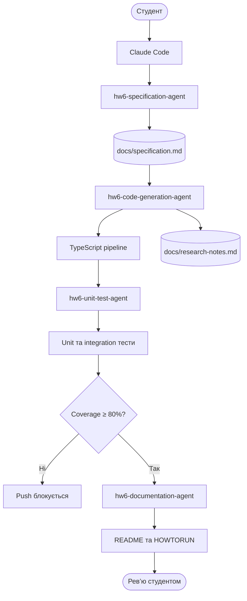
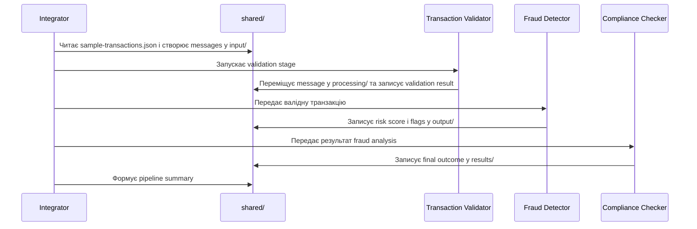
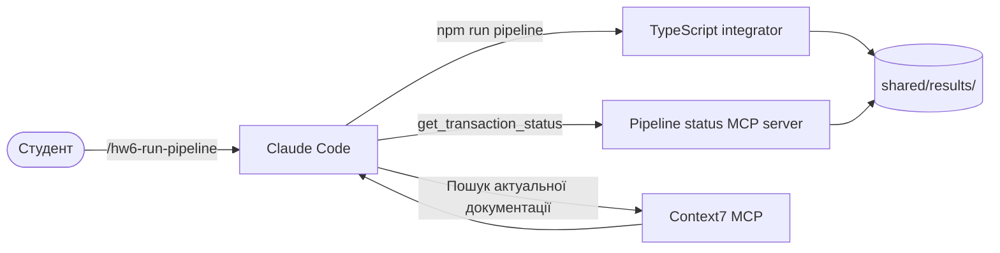

# Homework 6: AI-powered multi-agent banking pipeline

> **Студент:** ilia makarov  
> **Мова реалізації:** TypeScript  
> **Поточний стан:** Tasks 1–3 реалізовано; Task 4 має runnable TypeScript MCP server і Claude Code `.mcp.json`, screenshots відкладено до фінального етапу

## Про що цей проєкт

Мета Homework 6 — за допомогою Claude Code створити робочий застосунок, який послідовно обробляє банківські транзакції з `sample-transactions.json`. Застосунок перевірятиме транзакції, визначатиме ризик шахрайства, виконуватиме compliance-перевірку та записуватиме результат кожної транзакції в `shared/results/`.

Deliverable складається з двох частин: AI-інфраструктури для розробки та самого TypeScript-застосунку. Це два різні рівні, хоча в умові обидва названі «агентами».

> Claude Code не обробляє транзакції замість застосунку. AI допомагає створити, перевірити, запустити й задокументувати систему, а банківську логіку виконує звичайний детермінований TypeScript-код.

## Два рівні агентів

### Рівень 1: AI meta-agents у Claude Code

Це спеціалізовані AI-workflows, які створюють артефакти проєкту:

| AI meta-agent | Відповідальність | Результат |
|---|---|---|
| `hw6-specification-agent` | Формує загальну project spec та окремі feature specs | `docs/specification.md`, `docs/specifications/<feature-slug>.md` |
| `hw6-code-generation-agent` | Реалізує TypeScript pipeline та використовує Context7 | TypeScript-код і `docs/research-notes.md` |
| `hw6-unit-test-agent` | Створює unit/integration тести та контролює coverage | `tests/` і coverage gate |
| `hw6-documentation-agent` | Підтримує документацію проєкту | `README.md`, `HOWTORUN.md`, `docs/log.md` |

Ці агенти працюють під час розробки. Вони не є частиною банківського runtime.

### Рівень 2: TypeScript pipeline agents

Це звичайні TypeScript-модулі без LLM:

| Pipeline agent | Відповідальність |
|---|---|
| Transaction validator | Перевіряє обов’язкові поля, додатну точну суму та ISO 4217 currency code |
| Fraud detector | Обчислює risk score за великою сумою, незвичним часом і cross-border ознаками |
| Compliance checker | Приймає фінальне рішення та пояснює причину review/rejection |

`integrator.ts` послідовно викликатиме ці модулі. Для однієї транзакції вони не працюватимуть паралельно, тому що кожен наступний етап використовує результат попереднього.

## Загальний workflow Claude Code



## Як працюватиме TypeScript pipeline



Невалідна транзакція не зникає: для неї одразу створюється фінальний `rejected` result із причиною. Після запуску всі транзакції з input повинні бути представлені в `shared/results/`.

ASCII-схема того самого runtime flow, обов’язкова для документації завдання:

```text
sample-transactions.json
          |
          v
   +--------------+
   | integrator.ts|
   +--------------+
          |
          v
+-----------------------+     invalid     +------------------+
| transaction-validator | --------------> | shared/results/  |
+-----------------------+                 | status: rejected |
          | valid                         +------------------+
          v
+----------------+
| fraud-detector |
+----------------+
          |
          v
+--------------------+
| compliance-checker |
+--------------------+
          |
          v
 +----------------+
 | shared/results/|
 +----------------+
```

## Claude Code, pipeline та MCP



Custom MCP server не обробляє транзакції. Він лише читає готові результати та надає Claude Code tools `get_transaction_status`, `list_pipeline_results` і resource `pipeline://summary`. Status tool повертає тільки `transactionId`, `status`, `reasonCodes`, `riskScore` та `riskFlags`; raw transaction, `explanation` і `auditTrail` не виходять через MCP.

### MCP у Claude Code

У корені є один project-scoped `.mcp.json`, який Claude Code автоматично виявляє. Він підключає:

- `context7` для актуальної документації;
- `pipeline-status` для read-only доступу до `shared/results/`.

Після першого checkout або зміни `.mcp.json` запусти Claude Code з кореня Homework 6 і підтвердь використання project MCP servers. Перевірити їхній стан без запуску pipeline можна так:

```bash
claude mcp get context7
claude mcp get pipeline-status
```

До ручного approval статус буде `Pending approval`. Після approval у Claude Code можна попросити викликати `get_transaction_status` для конкретного `transaction_id`, викликати `list_pipeline_results` або прочитати resource `pipeline://summary`. Custom server читає лише фактичні files; перед MCP demo спочатку виконай `npm run pipeline`.

## Файлова комунікація

Застосунок використовуватиме обов’язковий JSON-протокол:

```text
shared/
├── input/       # початкові messages
├── processing/  # message, який зараз обробляється
├── output/      # проміжний результат для наступного agent
└── results/     # фінальні outcomes і summary
```

Кожне повідомлення матиме UUID, ISO 8601 timestamp, source/target agent, message type і transaction data. Account numbers та інші PII не потраплятимуть у plaintext logs.

## Запланований технологічний стек

| Частина | Технологія | Навіщо |
|---|---|---|
| Runtime | Node.js LTS | Запуск TypeScript-застосунку |
| Мова | TypeScript strict mode | Типобезпечна бізнес-логіка |
| Framework | Fastify | Мережевий/API та інтеграційний шар, якщо він потрібен |
| Money | Decimal library | Точні грошові значення без JavaScript floating-point помилок |
| File protocol | JSON у `shared/` | Обов’язкова комунікація між pipeline agents |
| Database, якщо потрібна | SQLite | Локальне довготривале зберігання без окремого DB server |
| ORM, якщо потрібна | Drizzle ORM | Type-safe доступ до SQLite |
| MCP | TypeScript MCP server | Запити Claude Code до pipeline results |

SQLite та Drizzle не додаються без конкретної потреби й не замінюють файловий протокол із завдання.

## Канонічна документація

- [`TASKS.md`](./TASKS.md) — оригінальні вимоги домашнього завдання.
- [`AGENTS.md`](./AGENTS.md) — головні правила для Claude Code, Codex і Gemini.
- [`docs/specification.md`](./docs/specification.md) — технічна специфікація pipeline.
- `docs/specifications/<feature-slug>.md` — окремі специфікації features перед їх реалізацією.
- [`docs/research-notes.md`](./docs/research-notes.md) — Context7 queries та застосовані висновки.
- [`docs/log.md`](./docs/log.md) — append-only хронологія змін.
- `HOWTORUN.md` — буде створено разом із runnable TypeScript pipeline.

### Як створюється feature specification

```text
/hw6-write-spec <feature-name>
        ↓
hw6-specification-agent
        ↓
hw6-writing-feature-specifications skill
        ↓
docs/specifications/<feature-slug>.md
```

Skill використовує локальний bundled template у `.claude/skills/hw6-writing-feature-specifications/assets/specification-template.md`, адаптований із `homework-3/specification-TEMPLATE-example.md`.

## Поточний стан

TypeScript pipeline і read-only Fastify API наявні в репозиторії. Фактичний запуск `npm run pipeline` обробив 8 sample transactions: `approved=3`, `review=3`, `rejected=2`. Rejected results: `TXN006` — `UNSUPPORTED_CURRENCY`; `TXN007` — `NON_POSITIVE_AMOUNT`.

TypeScript MCP layer реалізовано у `mcp/handlers.ts`, `mcp/server.ts` і `mcp/stdio.ts`. Focused tests перевірили safe handlers, обидва tools, `pipeline://summary`, controlled errors та реальний stdio process, запущений командою з `.mcp.json`. `claude mcp get` підтвердив, що Claude Code бачить `context7` і `pipeline-status` як project configuration; interactive approval і submission screenshot залишені студенту.

Dry-run `npm run validate:dry` повернув `total=8`, `valid=6`, `invalid=2`; SHA-256 усіх файлів у `shared/` до і після запуску збіглися. Fastify smoke на тимчасовому localhost-порту підтвердив `GET /health`, `GET /transactions/TXN001` і `GET /summary`; після перевірки server process зупинено.

## Команда запуску pipeline

Claude Code команда `/hw6-run-pipeline` перевіряє `sample-transactions.json`, запускає внутрішню application-команду `npm run pipeline`, читає безпечний summary із `shared/results/summary.json` і повідомляє лише лічильники та `transactionId`/`reasonCodes` rejected results. Вона не виводить account numbers, descriptions, raw payload або інші PII.

Claude Code команда `/hw6-validate-transactions` запускає лише validator у dry-run режимі через `npm run validate:dry`, показує безпечну таблицю validation results і не змінює `shared/results/`.
