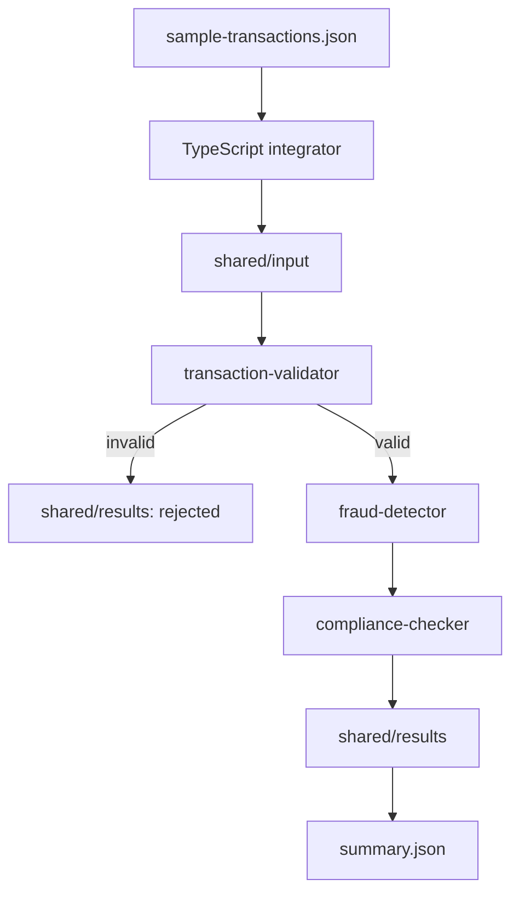
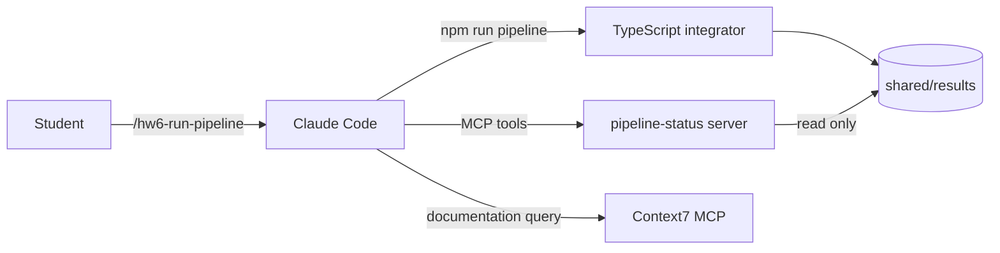

# Homework 6: AI-Powered Multi-Agent Banking Pipeline

> **Student:** ilia makarov
> **Language:** TypeScript
> **Status:** implemented and tested

## Overview

This project is a working banking transaction pipeline built with TypeScript. It reads transactions from `sample-transactions.json`, validates them, checks fraud risk, runs compliance rules, and writes one final result for every transaction to `shared/results/`.

The project has two agent levels. Claude Code AI meta-agents support development tasks. Deterministic TypeScript pipeline agents run the banking logic. Claude Code can start and inspect the pipeline, but it does not make runtime banking decisions.

## Agent Levels

### AI meta-agents

| AI meta-agent | Responsibility | Main output |
|---|---|---|
| `hw6-specification-agent` | Creates project and feature specifications | `docs/specification.md`, `docs/specifications/` |
| `hw6-code-generation-agent` | Builds TypeScript code and records Context7 research | `src/`, `docs/research-notes.md` |
| `hw6-unit-test-agent` | Creates tests and checks coverage | `tests/`, coverage gate |
| `hw6-documentation-agent` | Maintains project documentation | `README.md`, `HOWTORUN.md`, `docs/log.md` |

These workflows run during development. They are not part of the banking runtime.

### TypeScript pipeline agents

| Pipeline agent | Responsibility |
|---|---|
| `transaction-validator` | Checks required fields, positive decimal amounts, timestamps, and supported ISO 4217 currency codes |
| `fraud-detector` | Calculates a risk score from amount, unusual time, and cross-border rules |
| `compliance-checker` | Creates the final `approved`, `review`, or `rejected` decision |

## Working Runtime Flow

The integrator processes each transaction in sequence because every stage depends on the previous result.



```text
sample-transactions.json
          |
          v
   +---------------+
   |  integrator   |
   +---------------+
          |
          v
+-----------------------+     invalid     +------------------+
| transaction-validator | --------------> | shared/results/  |
+-----------------------+                 | status: rejected |
          | valid                         +------------------+
          v
+----------------+
| fraud-detector |
+----------------+
          |
          v
+--------------------+
| compliance-checker |
+--------------------+
          |
          v
 +----------------+
 | shared/results/|
 +----------------+
```

The pipeline uses these directories:

```text
shared/
├── input/       # initial message envelopes
├── processing/  # the message currently being processed
├── output/      # intermediate stage output
└── results/     # final outcomes and summary.json
```

Invalid transactions are not lost. The integrator writes a final rejected result with machine-readable reason codes.

## Claude Code and MCP Flow



The project-scoped `.mcp.json` connects two servers:

- `context7` provides current library documentation;
- `pipeline-status` provides read-only access to pipeline results.

The custom MCP server exposes:

- tool `get_transaction_status`;
- tool `list_pipeline_results`;
- resource `pipeline://summary`.

MCP responses contain only safe fields: `transactionId`, `status`, `reasonCodes`, `riskScore`, and `riskFlags`. Raw transactions, account data, explanations, and audit trails are not exposed.

## Implemented Interfaces

### CLI

```bash
npm run pipeline
npm run validate:dry
```

### Fastify API

| Method | Endpoint | Result |
|---|---|---|
| `GET` | `/health` | API health status |
| `GET` | `/summary` | Latest pipeline summary |
| `GET` | `/transactions/:transactionId` | Final result for one transaction |

### Claude Code commands

```text
/hw6-write-spec <feature-name>
/hw6-run-pipeline
/hw6-validate-transactions
```

## Technology Stack

| Area | Technology | Purpose |
|---|---|---|
| Runtime | Node.js 22+ | Runs the application |
| Language | TypeScript strict mode | Type-safe business logic |
| API | Fastify | Read-only HTTP interface |
| Money | Decimal.js | Precise monetary values |
| Validation | Zod and domain checks | Runtime data validation |
| File protocol | JSON in `shared/` | Communication between pipeline stages |
| Tests | Vitest with V8 coverage | Unit, integration, CLI, API, and MCP tests |
| MCP | TypeScript MCP SDK | Claude Code access to safe pipeline status |

SQLite and Drizzle are not used because the required JSON protocol is enough for this student project.

## Verified Result

The sample pipeline processes eight transactions:

```text
total=8
approved=3
review=3
rejected=2
rejected=TXN006: UNSUPPORTED_CURRENCY
rejected=TXN007: NON_POSITIVE_AMOUNT
```

The full suite contains 87 tests. The latest verified coverage was 95.93% statements, 92.35% branches, 96.61% functions, and 96.16% lines. The Claude Code coverage hook runs before a Bash `git push` tool call and blocks it when tests fail or a configured coverage metric is below 80%.

## Documentation

- [`TASKS.md`](./TASKS.md) — original homework requirements.
- [`AGENTS.md`](./AGENTS.md) — canonical AI tool instructions.
- [`docs/specification.md`](./docs/specification.md) — project specification.
- [`docs/research-notes.md`](./docs/research-notes.md) — Context7 research and applied patterns.
- [`docs/log.md`](./docs/log.md) — chronological project record.
- [`HOWTORUN.md`](./HOWTORUN.md) — complete setup, run, test, API, Claude Code, and MCP guide.

## Quick Start

```bash
npm install
npm run pipeline
npm test
```

See [`HOWTORUN.md`](./HOWTORUN.md) for the full workflow.
